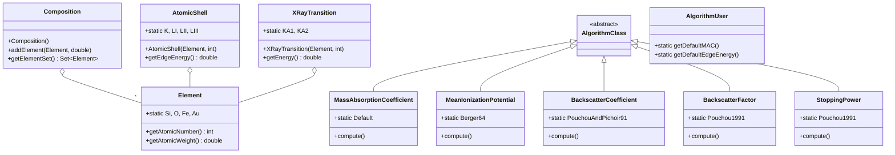

# EPQ Java API Reference Guide

## Document Purpose
Comprehensive reference for NIST EPQ (Electron Probe Quantification) Java library APIs, structured to match the `layers-edx` package organization.

**Package**: `gov.nist.microanalysis.EPQLibrary`

---

## Table of Contents

1. [Class Dependency Graph](#class-dependency-graph)
2. [Core Classes](#core-classes) - Element, Composition, AtomicShell, XRayTransition
3. [Material Properties](#material-properties) - All physics algorithms
4. [Correction Algorithms](#correction-algorithms) - PAP, XPP
5. [Utility Classes](#utility-classes) - ToSI, FromSI
6. [API Pattern Summary](#api-pattern-summary)
7. [Quick Reference](#quick-reference-for-test-implementation)

---

## Class Dependency Graph



---

## Core Classes

### Element

**File**: `element.py` → EPQ: `Element.java`

**Access**: Static constants

```java
Element.Si, Element.O, Element.Fe, Element.Au  // All periodic table elements
```

**Methods**:
```java
int z = Element.Si.getAtomicNumber();       // 14
double aw = Element.Si.getAtomicWeight();   // 28.0855
String sym = Element.Si.toAbbrev();         // "Si"
double ionE = Element.Si.getIonizationEnergy();  // Joules
```

---

### Composition

**File**: `element.py` → EPQ: `Composition.java`

**Constructors**:
```java
Composition pure = new Composition(Element.Si);  // Pure element
Composition comp = new Composition();             // Empty
```

**Methods**:
```java
comp.addElement(Element.Si, 0.467);  // Add with weight fraction
Set<Element> elements = comp.getElementSet();
double frac = comp.weightFraction(Element.Si, true);
```

---

### AtomicShell

**File**: `atomic_shell.py` → EPQ: `AtomicShell.java`

**Shell Constants**:
```java
AtomicShell.K                      // K shell
AtomicShell.LI, LII, LIII         // L shells  
AtomicShell.MI, MII, MIII, MIV, MV  // M shells
```

**Family Constants**:
```java
AtomicShell.KFamily, LFamily, MFamily, NFamily, OFamily
```

**Constructor & Methods**:
```java
AtomicShell siK = new AtomicShell(Element.Si, AtomicShell.K);
double edgeE = siK.getEdgeEnergy();
int family = siK.getFamily();
String name = siK.getIUPACName();  // "Si K"
```

---

### XRayTransition & XRayTransitionSet

**File**: `xrt.py` → EPQ: `XRayTransition.java`, `XRayTransitionSet.java`

**Transition Constants**:
```java
XRayTransition.KA1, KA2, KB
XRayTransition.LA1, LA2, LB1
```

**Constructor & Methods**:
```java
XRayTransition siKa1 = new XRayTransition(Element.Si, XRayTransition.KA1);
double energy = siKa1.getEnergy();
String name = siKa1.getIUPACName();
double weight = siKa1.getWeight(XRayTransition.NormalizeFamily);
```

**XRayTransitionSet**:
```java
XRayTransitionSet siK = new XRayTransitionSet(Element.Si, XRayTransitionSet.K_ALPHA);
Set<XRayTransition> transitions = siK.getTransitions();
```

---

## Material Properties

All classes in `layers_edx/material_properties/`

### MassAbsorptionCoefficient (MAC)

**File**: `mac.py` → EPQ: `MassAbsorptionCoefficient.java`

**Pattern**: Singleton `.Default`

**Methods**:
```java
double mac = MassAbsorptionCoefficient.Default.compute(Element el, double energy_J);
double mac = MassAbsorptionCoefficient.Default.compute(Composition comp, double energy_J);
```

**Usage**:
```java
double mac = MassAbsorptionCoefficient.Default.compute(Element.Si, ToSI.keV(1.74));
```

---

### MeanIonizationPotential (MIP)

**File**: `mip.py` → EPQ: `MeanIonizationPotential.java`

**Pattern**: Static implementations (NOT `.Default`!)

**Implementations**:
```java
MeanIonizationPotential.Berger64       // RECOMMENDED
MeanIonizationPotential.Berger83
MeanIonizationPotential.Sternheimer64
MeanIonizationPotential.Bloch33
MeanIonizationPotential.Wilson41
MeanIonizationPotential.Springer67
MeanIonizationPotential.Heinrich70
MeanIonizationPotential.Duncumb69
MeanIonizationPotential.Zeller75
```

**Methods**:
```java
double mip_J = MeanIonizationPotential.Berger64.compute(Element el);
double mip_J = MeanIonizationPotential.Berger64.computeLn(Composition comp);
```

---

### BackscatterCoefficient (BC)

**File**: `bc.py` → EPQ: `BackscatterCoefficient.java`

**Pattern**: Static implementations

**Implementations**:
```java
BackscatterCoefficient.PouchouAndPichoir91  // PAP algorithm
BackscatterCoefficient.Love1978
BackscatterCoefficient.Hunger1976
```

**Method**:
```java
double eta = BackscatterCoefficient.PouchouAndPichoir91.compute(Composition comp, double e0_J);
```

**Returns**: Backscatter coefficient η (dimensionless, 0-1 range)

---

### BackscatterFactor (BF)

**File**: `bf.py` → EPQ: `BackscatterFactor.java`

**Pattern**: Static implementations + `.Default`

**Implementations**:
```java
BackscatterFactor.Pouchou1991      // DEFAULT
BackscatterFactor.Duncumb1981
BackscatterFactor.Myklebust1984
BackscatterFactor.Love1978
BackscatterFactor.Default          // → Pouchou1991
```

**Method**:
```java
double r = BackscatterFactor.Default.compute(Composition comp, AtomicShell shell, double e0_J);
```

**Returns**: R factor (dimensionless, 0-1 range) - X-ray loss due to backscatter

---

### StoppingPower (SP)

**File**: `sp.py` → EPQ: `StoppingPower.java`

**Pattern**: Static implementations

**Implementations**:
```java
StoppingPower.Pouchou1991
StoppingPower.Proza96
StoppingPower.Thomas1963
StoppingPower.Reed1975
StoppingPower.LoveScottCITZAF
StoppingPower.PhilibertTixier1968
```

**Methods**:
```java
double s = StoppingPower.Pouchou1991.compute(Composition comp, AtomicShell shell, double e0_J);
double invS = StoppingPower.Pouchou1991.computeInv(Composition comp, AtomicShell shell, double e0_J);
double rel = StoppingPower.Pouchou1991.computeRelative(Composition unk, Composition std, AtomicShell shell, double e0_J);
```

**Unit Conversion**:
```java
double keVcm2g = StoppingPower.tokeVcmSqrPerGram(s_SI);
double s_SI = StoppingPower.fromkeVcmSqrPerGram(keVcm2g);
```

---

### ElectronRange (ER)

**File**: `er.py` → EPQ: `ElectronRange.java`

**Pattern**: Static implementations

**Implementations**:
```java
ElectronRange.KanayaAndOkayama1972
ElectronRange.Pouchou1991
```

**Method**:
```java
double range = ElectronRange.KanayaAndOkayama1972.compute(Composition comp, double e0_J);
```

**Returns**: Electron range in kg/m² (mass thickness)

---

### FluorescenceYield (FL)

**File**: `fl.py` → EPQ: `FluorescenceYield.java`

**Pattern**: Singleton `.DefaultShell`

**Method**:
```java
double omega = FluorescenceYield.DefaultShell.compute(AtomicShell shell);
```

---

### FluorescenceYieldMean (FYM)

**File**: `fym.py` → EPQ: `FluorescenceYieldMean.java`

**Pattern**: Singleton `.DefaultMean`

**Method**:
```java
double omegaMean = FluorescenceYieldMean.DefaultMean.compute(Element el, int family);
```

---

### IonizationCrossSection (ICS)

**File**: `ics.py` → EPQ: `IonizationCrossSection.java`

**Pattern**: Static implementations

**Implementations**:
```java
IonizationCrossSection.BoteSalvat2008
IonizationCrossSection.Pouchou86
```

**Method**:
```java
double sigma = IonizationCrossSection.BoteSalvat2008.compute(AtomicShell shell, double e0_J);
```

**Returns**: Cross-section in m²

---

### JumpRatio (JR)

**File**: `jr.py` → EPQ: `JumpRatio.java`

**Pattern**: Singleton `.Default`

**Method**:
```java
double r = JumpRatio.Default.compute(AtomicShell shell);
```

---

### SurfaceIonization (SI)

**File**: `si.py` → EPQ: `SurfaceIonization.java`

**Pattern**: Static implementations

**Implementations**:
```java
SurfaceIonization.Pouchou1991
```

**Method**:
```java
double s = SurfaceIonization.Pouchou1991.compute(Composition comp, AtomicShell shell, double e0_J);
```

---

### TransitionProbabilities (TP)

**File**: `tp.py` → EPQ: `TransitionEnergy.java` / `TransitionProbabilities.java`

**TransitionEnergy**:
```java
double energy = TransitionEnergy.Default.compute(XRayTransition xrt);
```

**TransitionProbabilities**:
```java
// Get all transitions from a shell with probabilities
TreeMap<XRayTransition, Double> trans = TransitionProbabilities.getTransitions(AtomicShell shell, double minWeight);
```

---

### EdgeEnergy

**Pattern**: Singleton `.Default`

**Method**:
```java
double edgeE = EdgeEnergy.Default.compute(AtomicShell shell);
```

---

### LeonardCoefficient (LC)

**File**: `lc.py` → EPQ: Part of correction algorithms

Related to PAP correction implementation.

---

### IonizationDepthRatio (IDR)

**File**: `idr.py` → EPQ: Part of correction algorithms  

Related to phi-rho-z correction calculations.

---

## Correction Algorithms

**Files**: `correction/pap.py`, `correction/xpp.py` → EPQ: `PAP1991.java`, `XPP1991.java`

### PAP1991

**Full PAP correction algorithm**

Incorporates: BackscatterFactor, StoppingPower, MassAbsorptionCoefficient, etc.

### XPP1991

**Full XPP correction algorithm**

**Default**: `CorrectionAlgorithm.XPPExtended`

---

## Utility Classes

### ToSI - Convert TO SI Units

**File**: `units.py` → EPQ: `ToSI.java`

**Methods**:
```java
double energy_J = ToSI.keV(20.0);     // keV → Joules
double energy_J = ToSI.eV(1740.0);    // eV → Joules
```

---

### FromSI - Convert FROM SI Units

**File**: `units.py` → EPQ: `FromSI.java`

**Methods**:
```java
double energy_keV = FromSI.keV(energy_J);
double energy_eV = FromSI.eV(energy_J);
```

**Common Pattern**:
```java
double energy_eV = energy_J / ToSI.eV(1.0);  // Alternative conversion
```

---

## AlgorithmUser - Central Provider

**Static Accessors** for default implementations:

```java
MassAbsorptionCoefficient mac = AlgorithmUser.getDefaultMAC();
BetheElectronEnergyLoss bethe = AlgorithmUser.getDefaultBetheEnergyLoss();
EdgeEnergy edge = AlgorithmUser.getDefaultEdgeEnergy();
TransitionEnergy trans = AlgorithmUser.getDefaultTransitionEnergy();
CorrectionAlgorithm corr = AlgorithmUser.getDefaultCorrectionAlgorithm();
FluorescenceYield fy = AlgorithmUser.getDefaultFluorescenceYield();
```

---

## API Pattern Summary

| layers_edx Module | EPQ Class | Access Pattern | Example |
|-------------------|-----------|----------------|---------|
| `element.py` | `Element` | Static constants | `Element.Si` |
| `element.py` | `Composition` | Constructor | `new Composition()` |
| `atomic_shell.py` | `AtomicShell` | Constructor | `new AtomicShell(el, shell)` |
| `xrt.py` | `XRayTransition` | Constructor | `new XRayTransition(el, idx)` |
| `xrt.py` | `XRayTransitionSet` | Constructor | `new XRayTransitionSet(el, fam)` |
| `mac.py` | `MassAbsorptionCoefficient` | Singleton `.Default` | `.Default.compute()` |
| `mip.py` | `MeanIonizationPotential` | Static instances | `.Berger64.compute()` |
| `bc.py` | `BackscatterCoefficient` | Static instances | `.PouchouAndPichoir91.compute()` |
| `bf.py` | `BackscatterFactor` | Static + `.Default` | `.Default.compute()` |
| `sp.py` | `StoppingPower` | Static instances | `.Pouchou1991.compute()` |
| `er.py` | `ElectronRange` | Static instances | `.KanayaAndOkayama1972.compute()` |
| `fl.py` | `FluorescenceYield` | Singleton `.DefaultShell` | `.DefaultShell.compute()` |
| `fym.py` | `FluorescenceYieldMean` | Singleton `.DefaultMean` | `.DefaultMean.compute()` |
| `ics.py` | `IonizationCrossSection` | Static instances | `.BoteSalvat2008.compute()` |
| `jr.py` | `JumpRatio` | Singleton `.Default` | `.Default.compute()` |
| `si.py` | `SurfaceIonization` | Static instances | `.Pouchou1991.compute()` |
| `tp.py` | `EdgeEnergy` | Singleton `.Default` | `.Default.compute()` |
| `tp.py` | `TransitionEnergy` | Singleton `.Default` | `.Default.compute()` |
| `units.py` | `ToSI` / `FromSI` | Static methods | `ToSI.keV(1.0)` |
| `correction/pap.py` | `PAP1991` | Instance | `new PAP1991()` |
| `correction/xpp.py` | `XPP1991` | Instance | `new XPP1991()` |

---

## Quick Reference for Test Implementation

### MAC
```java
double mac = MassAbsorptionCoefficient.Default.compute(Element.Si, ToSI.keV(1.74));
```

### MIP
```java
double mip_J = MeanIonizationPotential.Berger64.compute(Element.Si);
double mip_eV = FromSI.keV(mip_J) * 1000.0;
```

### Backscatter Coefficient
```java
double eta = BackscatterCoefficient.PouchouAndPichoir91.compute(comp, ToSI.keV(20.0));
```

### Backscatter Factor
```java
AtomicShell siK = new AtomicShell(Element.Si, AtomicShell.K);
double r = BackscatterFactor.Default.compute(comp, siK, ToSI.keV(20.0));
```

### Stopping Power
```java
double s = StoppingPower.Pouchou1991.compute(comp, siK, ToSI.keV(20.0));
double invS = StoppingPower.Pouchou1991.computeInv(comp, siK, ToSI.keV(20.0));
```

### Electron Range
```java
double range = ElectronRange.KanayaAndOkayama1972.compute(comp, ToSI.keV(20.0));
```

### Fluorescence Yield
```java
double omega = FluorescenceYield.DefaultShell.compute(siK);
double omegaMean = FluorescenceYieldMean.DefaultMean.compute(Element.Si, AtomicShell.KFamily);
```

### Ionization Cross-Section
```java
double sigma = IonizationCrossSection.BoteSalvat2008.compute(siK, ToSI.keV(20.0));
```

### X-Ray Transitions
```java
XRayTransition siKa1 = new XRayTransition(Element.Si, XRayTransition.KA1);
double energy_eV = siKa1.getEnergy() / ToSI.eV(1.0);
```

### Atomic Shell
```java
AtomicShell siK = new AtomicShell(Element.Si, AtomicShell.K);
double edgeE = siK.getEdgeEnergy();
```

### Edge & Transition Energy
```java
double edgeE = EdgeEnergy.Default.compute(siK);
double transE = TransitionEnergy.Default.compute(siKa1);
```

---

## Key Insights

1. **Inconsistent Patterns**: EPQ uses different access patterns:
   - Singleton `.Default`: MAC, EdgeEnergy, TransitionEnergy, FluorescenceYield
   - Named static instances: MIP, BackscatterCoefficient, StoppingPower  
   - Constructors: Element, Composition, AtomicShell, XRayTransition

2. **SI Units**: EPQ uses SI units internally (Joules for energy, m² for cross-sections)

3. **Unit Conversion**: Common pattern `value / ToSI.eV(1.0)` for J → eV

4. **AlgorithmClass Hierarchy**: All physics algorithms extend `AlgorithmClass`

5. **layers_edx Mapping**: Every module in `layers_edx/material_properties/` has corresponding EPQ class

---

## Document Status

**Structure**: ✅ Aligned with layers_edx package  
**Coverage**: ✅ All material properties classes documented  
**Last Updated**: 2024-11-23  
**Source**: EPQ `src/gov/nist/microanalysis/EPQLibrary/` + layers_edx structure
